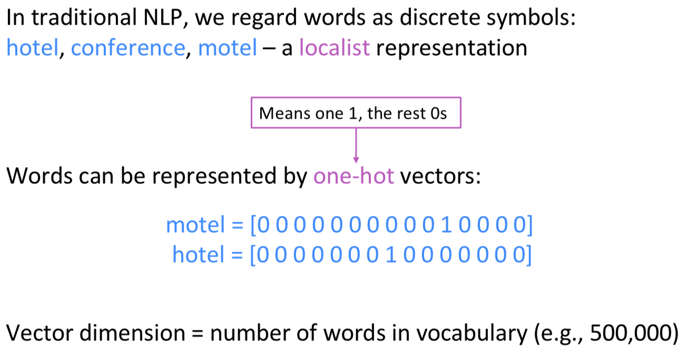

# Lecture 1-2 词向量总结(Word Vectors)

## 背景

#### 计算机如何表征词义(represent word meaning/word representation)

- 基于语言知识的表示(knowledge-based representation)
> WordNet

&nbsp;不足：上下文影响词是否同义，无法更新词库，主观性，耗费人力，无法体现词的相似性

- 离散的词向量表示(discrete symbols representation)
> One-hot vectors

&nbsp;不足：向量维度高，且稀疏正交，无法体现词的相关性

- 分布式的词向量表示(distributed representation/word vectors/word embeddings)
> Word vectors

获得词向量的方法，从基于统计的共现矩阵(co-occurrence matrix)、SVD，发展到基于语言模型的NNLM、Word2Vec、Glove、ELMo等

## 词向量

#### 共现矩阵(co-occurrence matrix)

#### SVD

#### NNLM

#### Word2Vec

#### Glove

#### ELMo

## 作业

## 扩展

## 参考
